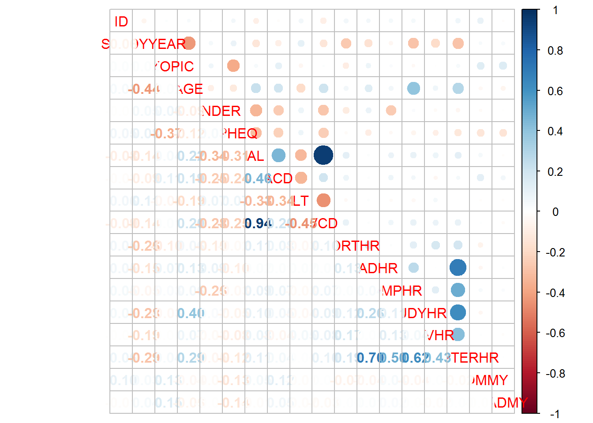
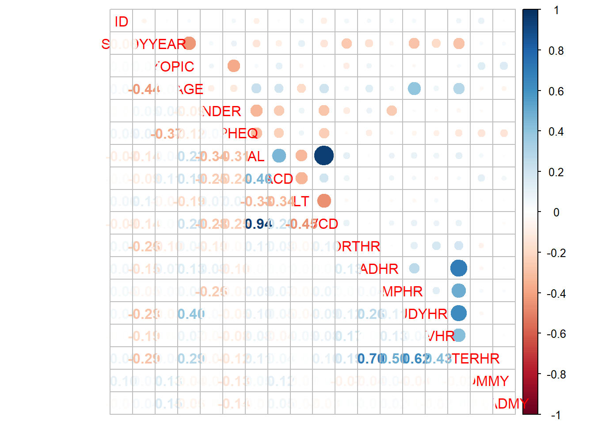
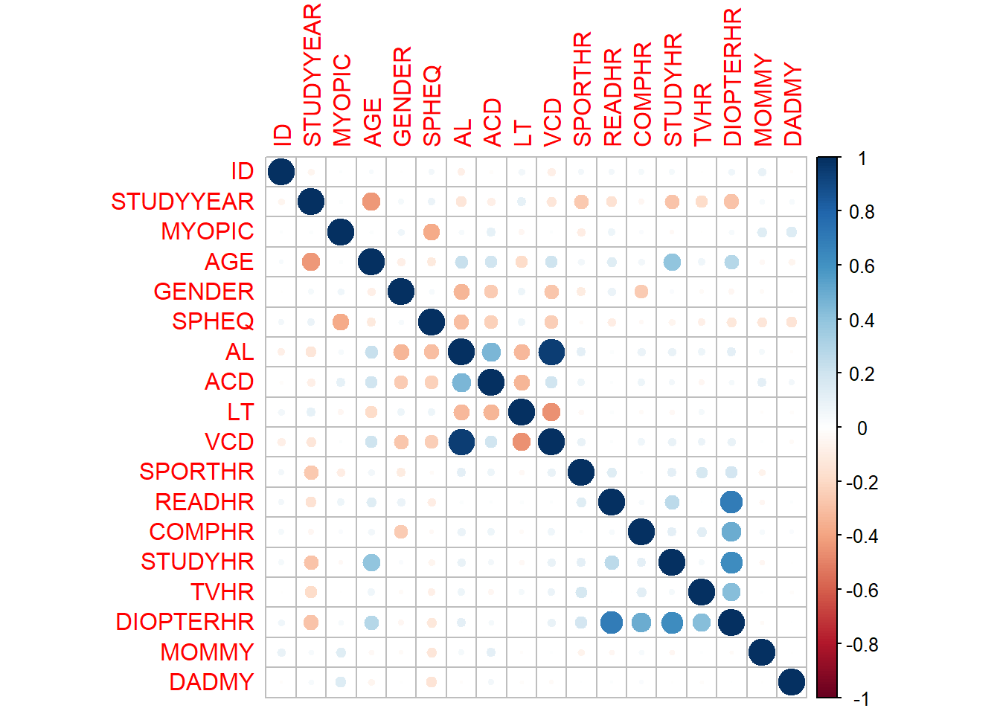

# 数据

## 数据集简介
该数据集是来自 Orinda 近视纵向研究 (OLSM) 的数据子集，这是一项眼科队列研究儿童近视发病的成分发育和危险因素。 数据收集始于 1989-1990 年学年，并每年持续到 2000-2001 学年。 有关构成眼睛的部分的所有数据（眼部成分）是在上学期间的一次考试中收集的。 家族史数据和在家长或监护人完成的一项调查中，每年都会收集视觉活动。

本文中使用的数据集来自 618 名至少接受五年随访且非近视的受试者
当他们进入队列时， 所有数据都来自他们的初始检查，数据集包括 17 个变量。 此外眼睛数据有关于进入年龄，进入年份，近视家族史和各种视觉小时数的信息活动。 眼部数据来自受试者的右眼。


```r
data <- read.csv('myopia.csv')
library(knitr)
```

```
## Warning: 程辑包'knitr'是用R版本4.1.3 来建造的
```

```r
knitr::kable(head(data)) 
```


| ID| STUDYYEAR| MYOPIC| AGE| GENDER|  SPHEQ|    AL|   ACD|    LT|   VCD| SPORTHR| READHR| COMPHR| STUDYHR| TVHR| DIOPTERHR| MOMMY| DADMY|
|--:|---------:|------:|---:|------:|------:|-----:|-----:|-----:|-----:|-------:|------:|------:|-------:|----:|---------:|-----:|-----:|
|  1|      1992|      1|   6|      1| -0.052| 21.89| 3.690| 3.498| 14.70|      45|      8|      0|       0|   10|        34|     1|     1|
|  2|      1995|      0|   6|      1|  0.608| 22.38| 3.702| 3.392| 15.29|       4|      0|      1|       1|    7|        12|     1|     1|
|  3|      1991|      0|   6|      1|  1.179| 22.49| 3.462| 3.514| 15.52|      14|      0|      2|       0|   10|        14|     0|     0|
|  4|      1990|      1|   6|      1|  0.525| 22.20| 3.862| 3.612| 14.73|      18|     11|      0|       0|    4|        37|     0|     1|
|  5|      1995|      0|   5|      0|  0.697| 23.29| 3.676| 3.454| 16.16|      14|      0|      0|       0|    4|         4|     1|     0|
|  6|      1995|      0|   6|      0|  1.744| 22.14| 3.224| 3.556| 15.36|      10|      6|      2|       1|   19|        44|     0|     1|

## 用SPHEQ预测近视

```r
library(tidyverse)
```


```r
data %>% 
  ggplot(.,aes(x=SPHEQ,y=MYOPIC))+
  geom_jitter(shape="O",position = position_jitter(height = 0))+
  theme_bw()
```



在这种情况下，“SPHEQ”显然会影响近视的存在，但不足以准确预测。 需要向模型添加更多属性以改进预测。 为此，需要检查每个属性与近视存在之间的相关性。

## 绘制所有变量之间的相关性

```r
library(corrplot)
```

```
## Warning: 程辑包'corrplot'是用R版本4.1.2 来建造的
```

```
## corrplot 0.92 loaded
```

```r
corrplot.mixed(cor(data))
```



```r
corrplot(cor(data))
```




很明显，例如“DIOPTERHR”与“SPORTHR”、“TVHR”、“STUDYHR”、“COMPHR”和“READHR”高度相关。因此，“DIOPTERHR”变量不会包含在预测模型中 为了防止共线性问题

## 变量与近视之间的相关性

再来看每个变量与近视的关联性如何

```r
library(corrplot)
correlations <- cor(data) 

pcor <- correlations[,3] %>% 
  print()
```

```
##           ID    STUDYYEAR       MYOPIC          AGE       GENDER        SPHEQ 
##  0.012242256  0.016330987  1.000000000  0.018525875  0.061556801 -0.373639054 
##           AL          ACD           LT          VCD      SPORTHR       READHR 
##  0.037752311  0.107952757 -0.045704451  0.011854862 -0.098282028  0.072749265 
##       COMPHR      STUDYHR         TVHR    DIOPTERHR        MOMMY        DADMY 
##  0.025874323 -0.031858867 -0.004032443  0.036983991  0.134032827  0.149896423
```

```r
 # corrplot(correlations)
```
 根据图中与近视高度相关的属性是“SPHEQ”、“ACD”、“MOMMY”、“DADMY”、“SPORTHR”、“READHR”、“GENDER”。
