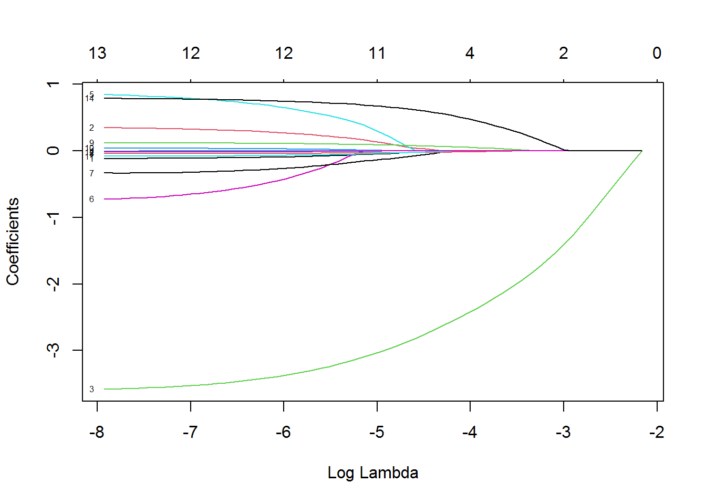
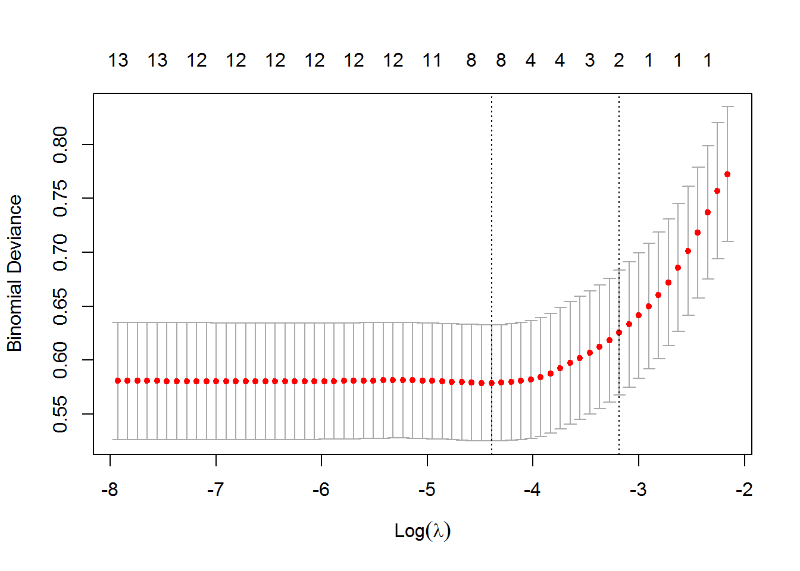
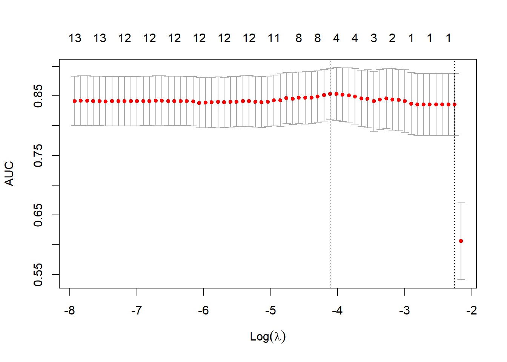
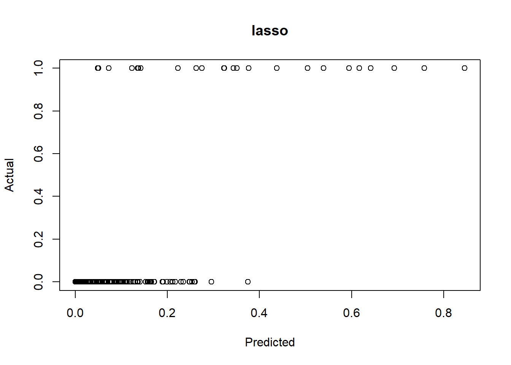
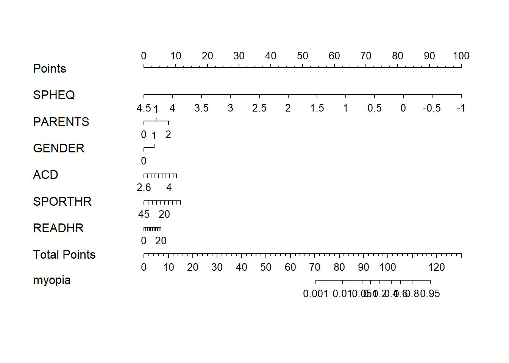
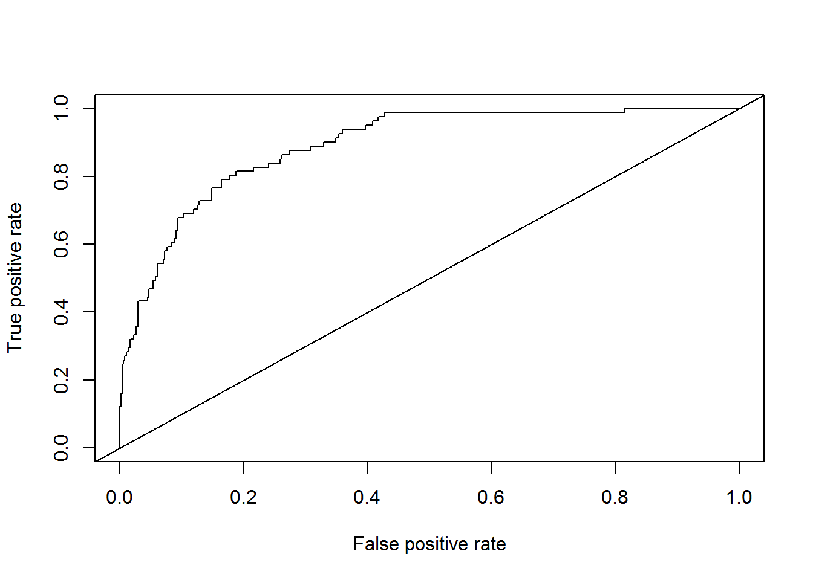
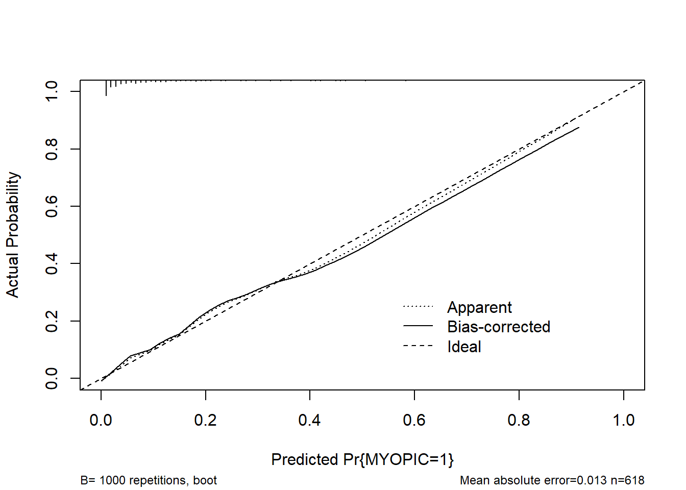
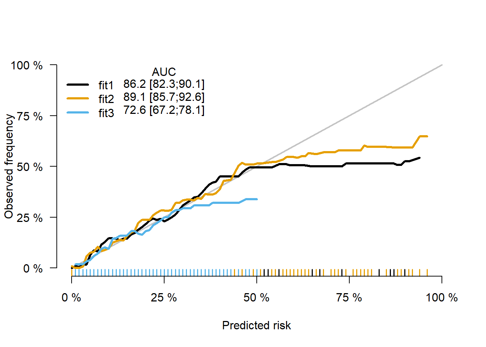
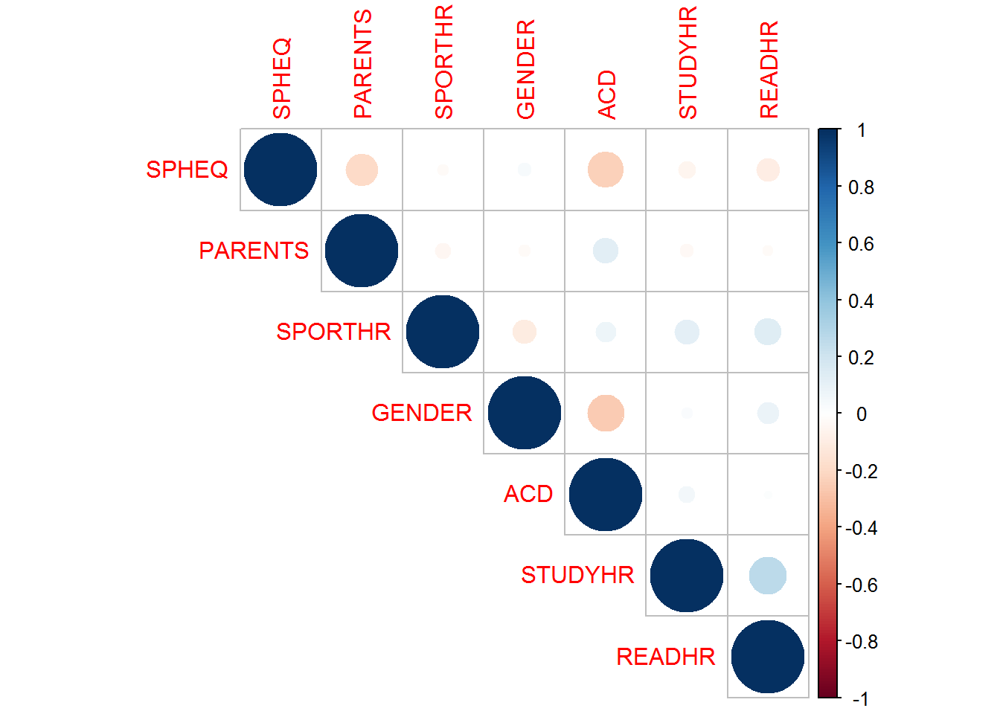
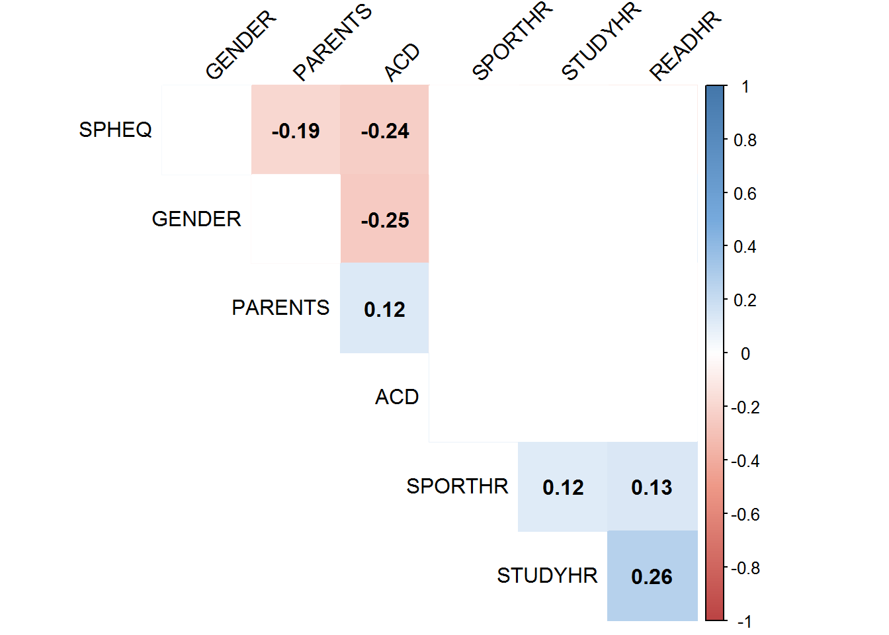

# LASSO-Logistic

*lasso 回归不能把数据处理成factor，如果涉及多分类，手动设置哑变量*

## 读入数据

```r
library(tidyverse)
```

```
## -- Attaching packages --------------------------------------- tidyverse 1.3.1 --
```

```
## v ggplot2 3.3.6     v purrr   0.3.4
## v tibble  3.1.7     v dplyr   1.0.7
## v tidyr   1.1.4     v stringr 1.4.0
## v readr   2.1.2     v forcats 0.5.1
```

```
## Warning: 程辑包'ggplot2'是用R版本4.1.3 来建造的
```

```
## Warning: 程辑包'tibble'是用R版本4.1.3 来建造的
```

```
## Warning: 程辑包'readr'是用R版本4.1.3 来建造的
```

```
## -- Conflicts ------------------------------------------ tidyverse_conflicts() --
## x dplyr::filter() masks stats::filter()
## x dplyr::lag()    masks stats::lag()
```

```r
myopia <- read.csv("myopia.csv") %>% 
  mutate(PARENTS=MOMMY+DADMY) %>% 
  select(ID:DIOPTERHR,PARENTS)
```

## 将数据集分成训练集和测试集

```r
library(caret)
```

```
## 载入需要的程辑包：lattice
```

```
## 
## 载入程辑包：'caret'
```

```
## The following object is masked from 'package:purrr':
## 
##     lift
```

```r
set.seed(1000)
index <- createDataPartition(
  myopia$MYOPIC,
  p = 0.7,
  list = FALSE
)
train <- myopia[index, ]
test <- myopia[-index, ]
```
## 加载包

```r
library(corrplot)
```

```
## Warning: 程辑包'corrplot'是用R版本4.1.2 来建造的
```

```
## corrplot 0.92 loaded
```

```r
library(car)
```

```
## 载入需要的程辑包：carData
```

```
## 
## 载入程辑包：'car'
```

```
## The following object is masked from 'package:dplyr':
## 
##     recode
```

```
## The following object is masked from 'package:purrr':
## 
##     some
```

```r
library(leaps)
```

```
## Warning: 程辑包'leaps'是用R版本4.1.3 来建造的
```

```r
library(glmnet)#岭回归、lasso、弹性网络模型
```

```
## Warning: 程辑包'glmnet'是用R版本4.1.3 来建造的
```

```
## 载入需要的程辑包：Matrix
```

```
## 
## 载入程辑包：'Matrix'
```

```
## The following objects are masked from 'package:tidyr':
## 
##     expand, pack, unpack
```

```
## Loaded glmnet 4.1-4
```

```r
library(caret)
#### 在glmnet()语法中alpha=0为岭回归，alpha=1表示lasso回归
```


```r
correlations <- cor(myopia)
pcor <- correlations[,3] %>%
  print()
```

```
##           ID    STUDYYEAR       MYOPIC          AGE       GENDER        SPHEQ 
##  0.012242256  0.016330987  1.000000000  0.018525875  0.061556801 -0.373639054 
##           AL          ACD           LT          VCD      SPORTHR       READHR 
##  0.037752311  0.107952757 -0.045704451  0.011854862 -0.098282028  0.072749265 
##       COMPHR      STUDYHR         TVHR    DIOPTERHR      PARENTS 
##  0.025874323 -0.031858867 -0.004032443  0.036983991  0.201417458
```

```r
corrplot.mixed(cor(myopia))
```


 “SPHEQ”, “ACD”, ‘’MOMMY”, “DADMY”, ”SPORTHR” , ”READHR”,”GENDER”
 
## 定义自变量，因变量

```r
x <- as.matrix(train[,4:17])
y <- train[,3]
lambdas <- 10 ^ seq(8,-4,length=250)
```
## lasso

```r
lasso <- glmnet(x,y,family = "binomial",alpha = 1)
print(lasso)
```

```
## 
## Call:  glmnet(x = x, y = y, family = "binomial", alpha = 1) 
## 
##    Df  %Dev   Lambda
## 1   0  0.00 0.115200
## 2   1  2.76 0.105000
## 3   1  5.36 0.095630
## 4   1  7.78 0.087140
## 5   1  9.99 0.079400
## 6   1 11.99 0.072340
## 7   1 13.78 0.065920
## 8   1 15.35 0.060060
## 9   1 16.73 0.054720
## 10  2 18.06 0.049860
## 11  2 19.49 0.045430
## 12  2 20.74 0.041400
## 13  3 21.91 0.037720
## 14  3 23.02 0.034370
## 15  3 23.98 0.031320
## 16  4 24.92 0.028530
## 17  4 25.79 0.026000
## 18  4 26.54 0.023690
## 19  4 27.19 0.021580
## 20  4 27.75 0.019670
## 21  4 28.23 0.017920
## 22  4 28.64 0.016330
## 23  5 29.01 0.014880
## 24  8 29.43 0.013560
## 25  8 29.82 0.012350
## 26  8 30.15 0.011250
## 27  8 30.44 0.010250
## 28  9 30.73 0.009343
## 29 10 31.00 0.008513
## 30 11 31.26 0.007757
## 31 11 31.48 0.007068
## 32 11 31.68 0.006440
## 33 11 31.84 0.005868
## 34 12 31.99 0.005347
## 35 12 32.12 0.004872
## 36 12 32.23 0.004439
## 37 12 32.32 0.004045
## 38 12 32.40 0.003685
## 39 12 32.47 0.003358
## 40 12 32.53 0.003060
## 41 12 32.57 0.002788
## 42 12 32.61 0.002540
## 43 12 32.65 0.002314
## 44 12 32.68 0.002109
## 45 12 32.70 0.001921
## 46 12 32.72 0.001751
## 47 12 32.74 0.001595
## 48 12 32.75 0.001454
## 49 12 32.76 0.001324
## 50 12 32.77 0.001207
## 51 12 32.78 0.001100
## 52 12 32.79 0.001002
## 53 12 32.79 0.000913
## 54 12 32.80 0.000832
## 55 12 32.80 0.000758
## 56 12 32.81 0.000691
## 57 13 32.81 0.000629
## 58 13 32.81 0.000573
## 59 13 32.81 0.000522
## 60 13 32.81 0.000476
## 61 13 32.82 0.000434
## 62 13 32.82 0.000395
## 63 13 32.82 0.000360
```


```r
plot(lasso,xvar="lambda",label = TRUE)
```



传入一个lambda值看看

```r
loss.coef <- predict(lasso,s=0.05,type = 'coefficients')
loss.coef
```

```
## 15 x 1 sparse Matrix of class "dgCMatrix"
##                      s1
## (Intercept) -1.04549610
## AGE          .         
## GENDER       .         
## SPHEQ       -1.40167370
## AL           .         
## ACD          .         
## LT           .         
## VCD          .         
## SPORTHR      .         
## READHR       .         
## COMPHR       .         
## STUDYHR      .         
## TVHR         .         
## DIOPTERHR    .         
## PARENTS      0.01645111
```
type=c("link", "response", "class", "coefficients", "nonzero")。link给出的是线性预测值，即进行logit变化前的值，函数默认值；response给出的是概率预测值，即进行logit变换之后的值；clase给出0/1预测值；coefficients给出的是指定λ值的模型系数；nonzero给出指定的定λ值时系数不为0的模型变量。

## cv交叉验证

```r
lasso.cv <- cv.glmnet(x,y, alpha=1,  family="binomial")
plot(lasso.cv)
```



```r
lasso.cv_auc <- cv.glmnet(x,y,alpha=1,family="binomial",type.measure = "auc")
plot(lasso.cv_auc)
```



横坐标是lambda的对数值，也就是惩罚力度，值越大，惩罚力度越大。纵坐标是模型的MSE(均方误差)。图形上方横坐标是自变量数量。随着lambda的增加，MSE不断变化。第一条虚线表示MSE最小值对应的lambda值，第二条虚线表示距离均方误差一个标准误时的lambda值（最优解）


```r
coef(lasso.cv , s = c(1,0.1,0.01,0.001))
```

```
## 15 x 4 sparse Matrix of class "dgCMatrix"
##                    s1         s2          s3          s4
## (Intercept) -1.906893 -1.7282362  0.16212542  4.02046678
## AGE          .         .         -0.02171082 -0.10849682
## GENDER       .         .          0.04626298  0.32335354
## SPHEQ        .        -0.2400235 -2.82801562 -3.51734389
## AL           .         .          .           .         
## ACD          .         .          0.01674432  0.78087139
## LT           .         .          .          -0.63712500
## VCD          .         .         -0.07605748 -0.31816768
## SPORTHR      .         .         -0.02514996 -0.03991801
## READHR       .         .          0.07966571  0.11800176
## COMPHR       .         .          .           0.03702366
## STUDYHR      .         .         -0.02353405 -0.07749223
## TVHR         .         .          .          -0.01674881
## DIOPTERHR    .         .          .           .         
## PARENTS      .         .          0.61989773  0.77437955
```

```r
lasso.cv_min <- lasso.cv$lambda.min %>% 
  print()
```

```
## [1] 0.01235143
```


```r
lasso.coef <- coef(lasso.cv$glmnet.fit,s=lasso.cv_min,exact = F)
lasso.coef
```

```
## 15 x 1 sparse Matrix of class "dgCMatrix"
##                       s1
## (Intercept) -0.470162303
## AGE         -0.009058156
## GENDER       0.015668469
## SPHEQ       -2.694167378
## AL           .          
## ACD          .          
## LT           .          
## VCD         -0.036936193
## SPORTHR     -0.022001607
## READHR       0.071207248
## COMPHR       .          
## STUDYHR     -0.012574109
## TVHR         .          
## DIOPTERHR    .          
## PARENTS      0.577869538
```

我们可以试一下如果选择1s是什么情况

```r
lasso.cv_1se <- lasso.cv$lambda.1se#通常使用距离MSE最小一个标准差lambda作为最合适的，直接调用即可

lasso.coef_1se<- coef(lasso.cv$glmnet.fit,s=lasso.cv_1se,exact = F)
lasso.coef_1se
```

```
## 15 x 1 sparse Matrix of class "dgCMatrix"
##                     s1
## (Intercept) -1.0378542
## AGE          .        
## GENDER       .        
## SPHEQ       -1.6514186
## AL           .        
## ACD          .        
## LT           .        
## VCD          .        
## SPORTHR      .        
## READHR       .        
## COMPHR       .        
## STUDYHR      .        
## TVHR         .        
## DIOPTERHR    .        
## PARENTS      0.1220882
```

## lasso在测试集上的表现

```r
newx=as.matrix(test[4:17])
lasso.y <- predict(lasso,newx = newx,type = "response",s=0.01235)
plot(lasso.y,test$MYOPIC,xlab="Predicted",ylab="Actual",main="lasso")
```




## 建立模型并绘制列线图

### 建立一个模型吧

```r
library(rms)
```

```
## Warning: 程辑包'rms'是用R版本4.1.3 来建造的
```

```
## 载入需要的程辑包：Hmisc
```

```
## Warning: 程辑包'Hmisc'是用R版本4.1.3 来建造的
```

```
## 载入需要的程辑包：survival
```

```
## 
## 载入程辑包：'survival'
```

```
## The following object is masked from 'package:caret':
## 
##     cluster
```

```
## 载入需要的程辑包：Formula
```

```
## 
## 载入程辑包：'Hmisc'
```

```
## The following objects are masked from 'package:dplyr':
## 
##     src, summarize
```

```
## The following objects are masked from 'package:base':
## 
##     format.pval, units
```

```
## 载入需要的程辑包：SparseM
```

```
## 
## 载入程辑包：'SparseM'
```

```
## The following object is masked from 'package:base':
## 
##     backsolve
```

```
## 
## 载入程辑包：'rms'
```

```
## The following objects are masked from 'package:car':
## 
##     Predict, vif
```

```r
dd <- datadist(myopia)
options(datadist=dd)
model<- lrm(MYOPIC~SPHEQ+PARENTS+GENDER+ACD+SPORTHR+READHR,data=myopia,x=TRUE,y=TRUE)
```

### 列线图1

```r
nom1 <- nomogram(model,fun = plogis,fun.at=c(0.001,0.01,0.05,0.1,seq(0.2,0.8,by=0.2),0.95,1.0),lp=FALSE,funlabel = 'myopia')
plot(nom1)
```


### 列线图2

```r
# # install.packages("DynNom")
# library(DynNom)
# model_dynnom <- glm(MYOPIC~SPHEQ+PARENTS+GENDER+ACD+SPORTHR+READHR,data=myopia,family = binomial())
# DynNom(model_dynnom,DNtitle = "Nomogram",DNxlab = "Probability")
```


### C统计量

```r
myopia$predvalue <- predict(model)
# install.package('ROCR')
library(ROCR)
```

```
## Warning: 程辑包'ROCR'是用R版本4.1.3 来建造的
```

```r
pred <- prediction(myopia$predvalue,myopia$MYOPIC)
perf <- performance(pred,"tpr","fpr")
plot(perf)
abline(0,1)
```



```r
auc <- performance(pred,"auc")
auc@y.values
```

```
## [[1]]
## [1] 0.8914178
```

```r
# model_glm <- glm(MYOPIC~SPHEQ+PARENTS+GENDER+ACD+SPORTHR+READHR,data = myopia,family = binomial())
# myopia$predvalue <- predict(model_glm)
# # install.package('ROCR')
# library(ROCR)
# pred <- prediction(myopia$predvalue,myopia$MYOPIC)
# perf <- performance(pred,"tpr","fpr")
# plot(perf)
# abline(0,1)
# auc <- performance(pred,"auc")
# auc@y.values
```


### 校正曲线

```r
cal1 <- calibrate(model,method = "boot",B=1000)
plot(cal1,xlim=c(0,1.0),ylim=c(0,1.0))
```



```
## 
## n=618   Mean absolute error=0.013   Mean squared error=3e-04
## 0.9 Quantile of absolute error=0.032
```


### ps：同时绘制多条

```r
formula1 <- as.formula(MYOPIC~SPHEQ)

formula2 <- as.formula(MYOPIC~SPHEQ+PARENTS+GENDER+ACD+SPORTHR+READHR)

formula3 <- as.formula(MYOPIC~PARENTS+GENDER+ACD+SPORTHR+READHR)

DD=datadist(myopia)
options(datadist='DD')
```


```r
fit1 = glm(formula1, data=myopia,family = binomial())
fit2 = glm(formula2, data=myopia,family = binomial())
fit3 = glm(formula3, data=myopia,family = binomial())


library(riskRegression)
```

```
## Warning: 程辑包'riskRegression'是用R版本4.1.3 来建造的
```

```
## riskRegression version 2022.03.22
```

```r
xb <- Score(list("fit1"=fit1,
                 "fit2"=fit2,
                 "fit3"=fit3),
            formula=MYOPIC~1,
            null.model = FALSE,
            conf.int =TRUE,
            plots =c("calibration","ROC"),
            metrics = c("auc"),
            B=1000,M=50,
            data=myopia)
plotCalibration(xb)
```

```
## Warning in getLegendData(object = x, models = models, times = tp, auc.in.legend
## = auc.in.legend, : Cannot show Brier score as it is not stored in object. Set
## metrics='brier' in the call of Score.
```




## 共线性讨论

```r
#collinearity 
collin <- cor(subset(myopia, select=c(SPHEQ, PARENTS, SPORTHR, GENDER ,ACD , STUDYHR,READHR)))
# dev.off()
library(corrplot)
corrplot(collin , type="upper")
```



```r
M <- collin
cor.mtest <- function(mat, ...) {
  mat <- as.matrix(mat)
  n <- ncol(mat)
  p.mat<- matrix(NA, n, n)
  diag(p.mat) <- 0
  for (i in 1:(n - 1)) {
    for (j in (i + 1):n) {
      tmp <- cor.test(mat[, i], mat[, j], ...)
      p.mat[i, j] <- p.mat[j, i] <- tmp$p.value
    }
  }
  colnames(p.mat) <- rownames(p.mat) <- colnames(mat)
  p.mat
}
# matrix of the p-value of the correlation
p.mat <- cor.mtest(subset(myopia, select=c(SPHEQ, PARENTS,  
                                           SPORTHR, GENDER ,ACD , STUDYHR,READHR)))
head(p.mat[, 1:6])
```

```
##                SPHEQ      PARENTS     SPORTHR       GENDER          ACD
## SPHEQ   0.000000e+00 1.351303e-06 0.577189469 4.206886e-01 1.841368e-09
## PARENTS 1.351303e-06 0.000000e+00 0.270789297 5.333279e-01 2.718984e-03
## SPORTHR 5.771895e-01 2.707893e-01 0.000000000 1.025312e-02 6.185484e-02
## GENDER  4.206886e-01 5.333279e-01 0.010253119 0.000000e+00 1.757790e-10
## ACD     1.841368e-09 2.718984e-03 0.061854843 1.757790e-10 0.000000e+00
## STUDYHR 1.730743e-01 3.891322e-01 0.003930083 5.391071e-01 1.982234e-01
##             STUDYHR
## SPHEQ   0.173074294
## PARENTS 0.389132155
## SPORTHR 0.003930083
## GENDER  0.539107149
## ACD     0.198223365
## STUDYHR 0.000000000
```

```r
col <- colorRampPalette(c("#BB4444", "#EE9988", "#FFFFFF", 
                          "#77AADD", "#4477AA"))

#create correlation plot
corrplot(M, method="color", col=col(200),  
         type="upper", order="hclust", 
         addCoef.col = "black", # Add coefficient of correlation
         tl.col="black", tl.srt=45, #Text label color and rotation
         # Combine with significance
         p.mat = p.mat, sig.level = 0.01, insig = "blank", 
         # hide correlation coefficient on the principal diagonal
         diag=FALSE )
```




```r
vif(model)
```

```
##    SPHEQ  PARENTS   GENDER      ACD  SPORTHR   READHR 
## 1.034080 1.032454 1.101447 1.092771 1.054899 1.060157
```
VIF 值 >= 10 表示高共线性。在这种情况下，所有 vif 值都接近 小于10
