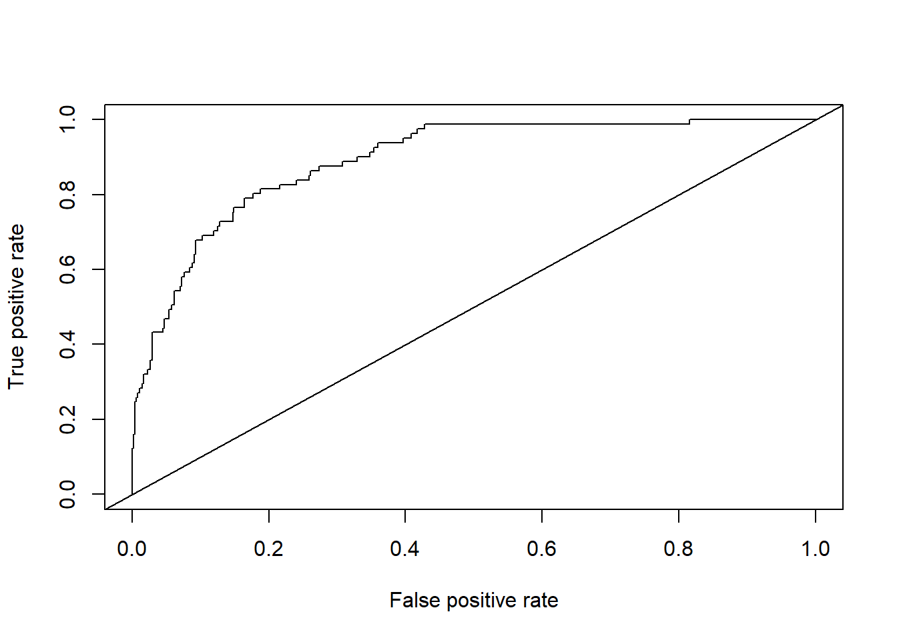
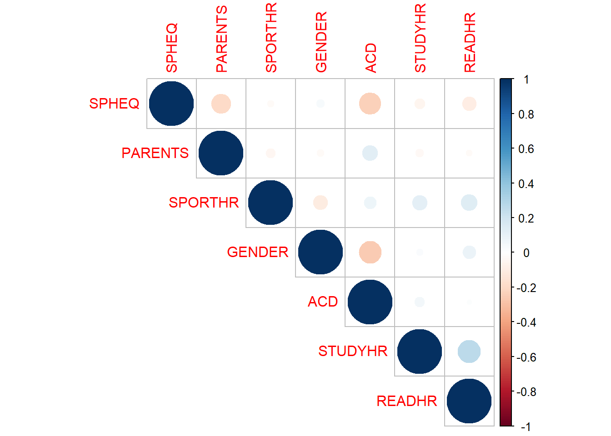
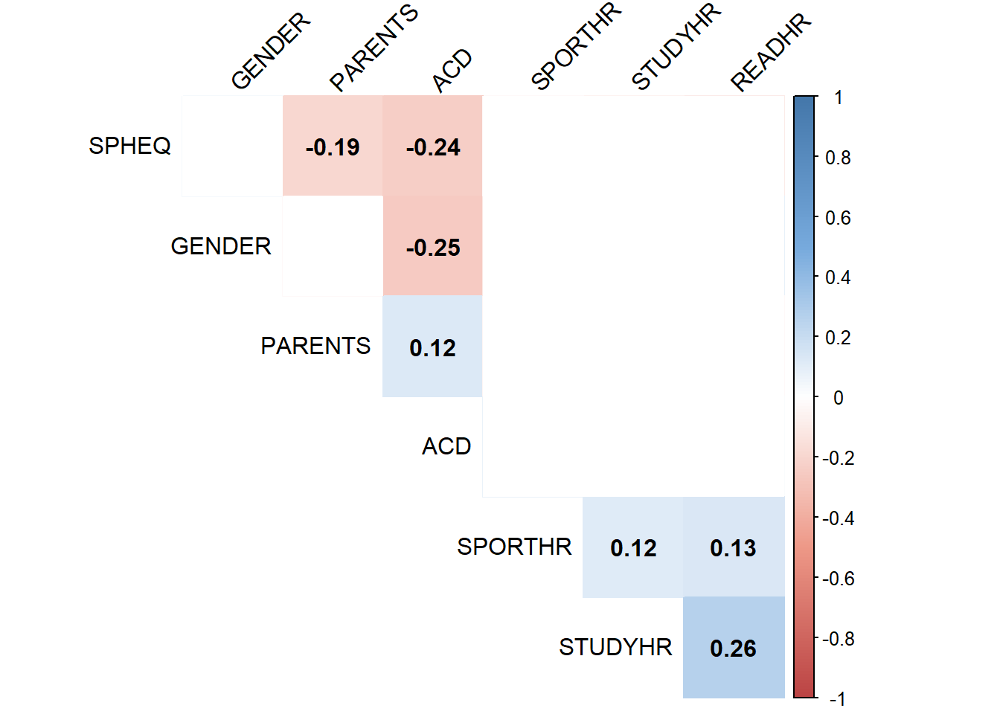

# 模型构建及评价

## 建立模型并绘制列线图

### 建立一个模型

```r
library(tidyverse)
myopia <- read.csv("myopia.csv") %>% 
  mutate(PARENTS=MOMMY+DADMY) %>% 
  select(ID:DIOPTERHR,PARENTS)
library(rms)
dd <- datadist(myopia)
options(datadist=dd)
model<- lrm(MYOPIC~SPHEQ+PARENTS+GENDER+ACD+SPORTHR+READHR,data=myopia,x=TRUE,y=TRUE)#作为模型进行下面的操作
```

### 列线图1

```r
nom1 <- nomogram(model,fun = plogis,fun.at=c(0.001,0.01,0.05,0.1,seq(0.2,0.8,by=0.2),0.95,1.0),lp=FALSE,funlabel = 'myopia')
plot(nom1)
```


### 列线图2

```r
# # install.packages("DynNom")
# library(DynNom)
# model_dynnom <- glm(MYOPIC~SPHEQ+PARENTS+GENDER+ACD+SPORTHR+READHR,data=myopia,family = binomial())
# DynNom(model_dynnom,DNtitle = "Nomogram",DNxlab = "Probability")
```


### C统计量

```r
myopia$predvalue <- predict(model)
# install.package('ROCR')
library(ROCR)
```

```
## Warning: 程辑包'ROCR'是用R版本4.1.3 来建造的
```

```r
pred <- prediction(myopia$predvalue,myopia$MYOPIC)
perf <- performance(pred,"tpr","fpr")
plot(perf)
abline(0,1)
```



```r
auc <- performance(pred,"auc")
auc@y.values
```

```
## [[1]]
## [1] 0.8914178
```

```r
# model_glm <- glm(MYOPIC~SPHEQ+PARENTS+GENDER+ACD+SPORTHR+READHR,data = myopia,family = binomial())
# myopia$predvalue <- predict(model_glm)
# # install.package('ROCR')
# library(ROCR)
# pred <- prediction(myopia$predvalue,myopia$MYOPIC)
# perf <- performance(pred,"tpr","fpr")
# plot(perf)
# abline(0,1)
# auc <- performance(pred,"auc")
# auc@y.values
```

### Brier评分
-   Brief分数，是衡量概率校准的一个参数。
-   简单来说，可以被认为是对一组概率预测的"校准"的量度，或者称为"成本函数"，这一组概率对应的情况必须互斥，并且概率之和必须为1.
-   Brier score 计算公式如下（仅针对二分类资料） $Loss=\frac{1}{N} \sum_{i=1}^{N} (y{i} -p{i})^2$

-   其中yi为样本的真是标签，取值为0或1；pi为模型预测为正的概率。N是预测事件数量。
-   式子直接计算了真实标签和预测概率的均方误差，Brier score越小则校准效果越好。

利用lrm函数构建：

```r
# #计算logit P ,俗称的线性预测值
# pred.logit1 <- predict(model)
# #计算预测概率
# P1 <- 1/(1+exp(-pred.logit1))
# m=NROW(data)/3
# #绘图
# val.prob(P1,data$MYOPIC,m=m,cex=0.8)
```
利用glm函数构建：

```r
# model_glm<- glm(MYOPIC~SPHEQ+PARENTS+GENDER+ACD+SPORTHR+READHR,data=myopia,family = "binomial")
# #计算logitP
# pred.logit2 <- predict(model)
# #预测概率P
# P2 <- predict(model_glm,type="response")
# #绘图
# val.prob(P2,data$MYOPIC,m=m,cex = 0.8)# m,subgroups obs
```

### 校正曲线

```r
cal1 <- calibrate(model,method = "boot",B=1000)
plot(cal1,xlim=c(0,1.0),ylim=c(0,1.0))
```


```
## 
## n=618   Mean absolute error=0.013   Mean squared error=0.00028
## 0.9 Quantile of absolute error=0.03
```


### ps：同时绘制多条

```r
formula1 <- as.formula(MYOPIC~SPHEQ)

formula2 <- as.formula(MYOPIC~SPHEQ+PARENTS+GENDER+ACD+SPORTHR+READHR)

formula3 <- as.formula(MYOPIC~PARENTS+GENDER+ACD+SPORTHR+READHR)

DD=datadist(myopia)
options(datadist='DD')
```


```r
fit1 = glm(formula1, data=myopia,family = binomial())
fit2 = glm(formula2, data=myopia,family = binomial())
fit3 = glm(formula3, data=myopia,family = binomial())


library(riskRegression)
```

```
## Warning: 程辑包'riskRegression'是用R版本4.1.3 来建造的
```

```
## riskRegression version 2022.03.22
```

```r
xb <- Score(list("fit1"=fit1,
                 "fit2"=fit2,
                 "fit3"=fit3),
            formula=MYOPIC~1,
            null.model = FALSE,
            conf.int =TRUE,
            plots =c("calibration","ROC"),
            metrics = c("auc"),
            B=1000,M=50,
            data=myopia)
plotCalibration(xb)
```

```
## Warning in getLegendData(object = x, models = models, times = tp, auc.in.legend
## = auc.in.legend, : Cannot show Brier score as it is not stored in object. Set
## metrics='brier' in the call of Score.
```


ps:共线性讨论的R实现

```r
#collinearity 
collin <- cor(subset(myopia, select=c(SPHEQ, PARENTS, SPORTHR, GENDER ,ACD , STUDYHR,READHR)))
# dev.off()
library(corrplot)
```

```
## Warning: 程辑包'corrplot'是用R版本4.1.2 来建造的
```

```
## corrplot 0.92 loaded
```

```r
corrplot(collin , type="upper")
```



```r
M <- collin
cor.mtest <- function(mat, ...) {
  mat <- as.matrix(mat)
  n <- ncol(mat)
  p.mat<- matrix(NA, n, n)
  diag(p.mat) <- 0
  for (i in 1:(n - 1)) {
    for (j in (i + 1):n) {
      tmp <- cor.test(mat[, i], mat[, j], ...)
      p.mat[i, j] <- p.mat[j, i] <- tmp$p.value
    }
  }
  colnames(p.mat) <- rownames(p.mat) <- colnames(mat)
  p.mat
}
# matrix of the p-value of the correlation
p.mat <- cor.mtest(subset(myopia, select=c(SPHEQ, PARENTS,  
                                           SPORTHR, GENDER ,ACD , STUDYHR,READHR)))
head(p.mat[, 1:6])
```

```
##                SPHEQ      PARENTS     SPORTHR       GENDER          ACD
## SPHEQ   0.000000e+00 1.351303e-06 0.577189469 4.206886e-01 1.841368e-09
## PARENTS 1.351303e-06 0.000000e+00 0.270789297 5.333279e-01 2.718984e-03
## SPORTHR 5.771895e-01 2.707893e-01 0.000000000 1.025312e-02 6.185484e-02
## GENDER  4.206886e-01 5.333279e-01 0.010253119 0.000000e+00 1.757790e-10
## ACD     1.841368e-09 2.718984e-03 0.061854843 1.757790e-10 0.000000e+00
## STUDYHR 1.730743e-01 3.891322e-01 0.003930083 5.391071e-01 1.982234e-01
##             STUDYHR
## SPHEQ   0.173074294
## PARENTS 0.389132155
## SPORTHR 0.003930083
## GENDER  0.539107149
## ACD     0.198223365
## STUDYHR 0.000000000
```

```r
col <- colorRampPalette(c("#BB4444", "#EE9988", "#FFFFFF", 
                          "#77AADD", "#4477AA"))

#create correlation plot
corrplot(M, method="color", col=col(200),  
         type="upper", order="hclust", 
         addCoef.col = "black", # Add coefficient of correlation
         tl.col="black", tl.srt=45, #Text label color and rotation
         # Combine with significance
         p.mat = p.mat, sig.level = 0.01, insig = "blank", 
         # hide correlation coefficient on the principal diagonal
         diag=FALSE )
```




```r
vif(model)
```

```
##    SPHEQ  PARENTS   GENDER      ACD  SPORTHR   READHR 
## 1.034080 1.032454 1.101447 1.092771 1.054899 1.060157
```
VIF 值 >= 10 表示高共线性。在这种情况下，所有 vif 值都接近 小于10


